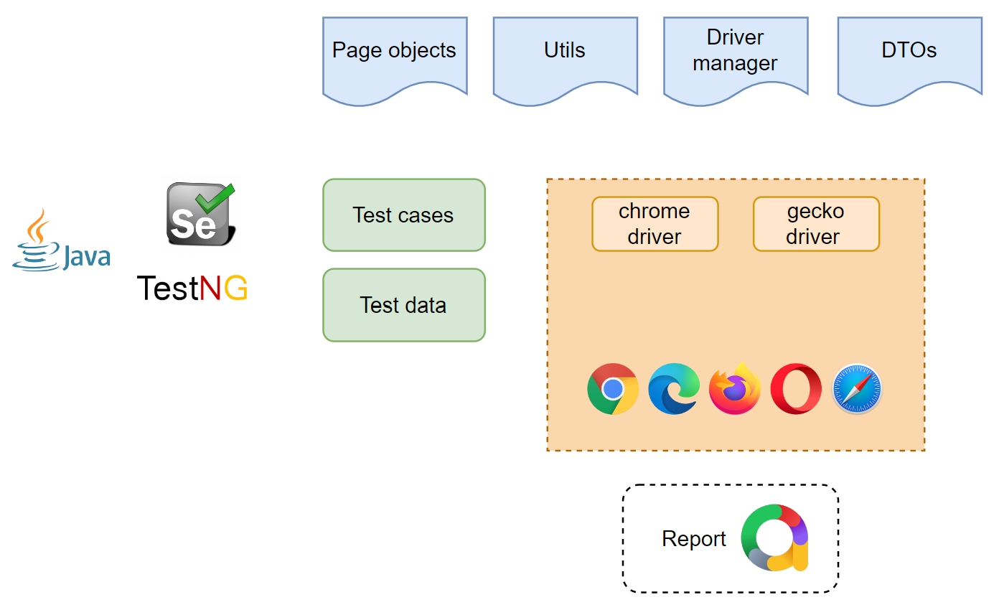

# Demo - Alkilautos

The purpose of this Test Automation Project is to showcase how selenium works by using POM pattern to automate a single path. 

Prerequisites:
- Java 8 or higher
- Gradle 7.5 or higher

Installation:
- Clone the repository from [Github](https://github.com)
- Run command ```./gradlew build``` to install all dependencies

This suite can be easily run via command line by following the next steps:
- Test suite: ```./gradlew clean test```

Once automation test execution is done, the following command is needed to run to generate the report in Allure
- ```allure serve allure-results```



